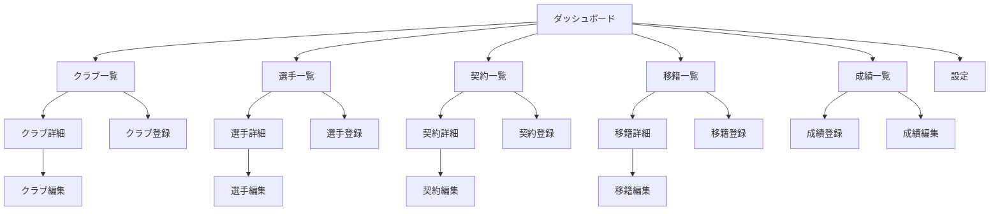

# アプリケーション概要

## 画面構成

アプリケーションは以下の主要な画面で構成されています。

1. **ダッシュボード (`/`)**
   - アプリケーションのトップページ。
   - 主要な統計指標（KPI）を表示。
   - 最新の更新情報をウィジェット形式で提示。

2. **クラブ管理 (`/clubs/**`)\*\*
   - **一覧画面 (`/clubs`)**: 登録済みクラブのリスト表示、検索。
   - **詳細画面 (`/clubs/[id]`)**: クラブの基本情報と所属選手一覧。
   - **登録・編集画面 (`/clubs/new`, `[id]/edit`)**: クラブ情報の入力フォーム。

3. **選手管理 (`/players/**`)\*\*
   - **一覧画面 (`/players`)**: 選手検索、ポジションフィルタリング。
   - **詳細画面 (`/players/[id]`)**: プロフィール、現在の契約、移籍履歴、成績履歴。
   - **登録・編集画面 (`/players/new`, `[id]/edit`)**: 選手情報の入力フォーム。

4. **契約管理 (`/contracts/**`)\*\*
   - **一覧画面 (`/contracts`)**: 全契約データのリスト。
   - **詳細画面 (`/contracts/[id]`)**: 契約の詳細条件。
   - **登録・編集画面 (`/contracts/new`, `[id]/edit`)**: 選手とクラブを紐付ける契約登録。

5. **移籍管理 (`/transfers/**`)\*\*
   - **一覧画面 (`/transfers`)**: 移籍市場の動向リスト。年別フィルタ。
   - **詳細画面 (`/transfers/[id]`)**: 移籍金、移籍日、元・先クラブ情報。
   - **登録・編集画面 (`/transfers/new`, `[id]/edit`)**: 移籍情報の記録。

6. **成績管理 (`/stats/**`)\*\*
   - **一覧画面 (`/stats`)**: シーズンごとの選手成績リスト。
   - **登録・編集画面 (`/stats/new`, `[id]/edit`)**: ゴール数、試合数などの記録。

7. **設定 (`/settings`)**
   - アプリケーション全般の設定。
   - テーマ切り替え。
   - データインポート機能。

## 画面遷移

基本的には「一覧」→「詳細」→「編集」という階層構造を持ちます。

## 主なユースケースフロー

### 1. 新しい選手の入団登録

ユーザーは新しい選手がクラブに加入した情報を登録します。

1. **クラブ確認**: 対象の「クラブ詳細」画面を開き、現状を確認。
2. **選手登録**: 「選手登録」画面へ移動し、選手プロフィールを作成。
3. **契約登録**: 「契約登録」画面へ移動し、作成した選手とクラブ、契約期間、年俸を入力して保存。
4. **確認**: 選手詳細画面で、所属クラブが表示されていることを確認。

### 2. 移籍の記録

既存の契約選手が他のクラブへ移籍する場合のフローです。

1. **移籍登録**: 「移籍登録」画面を開く。
2. **入力**: 対象選手、移籍元クラブ、移籍先クラブ、移籍金、日付を入力。
3. **保存**: データを保存すると、移籍履歴に追加される。
4. **契約更新**: 旧契約を終了済みにし、新クラブとの契約を新規登録する（または運用でカバー）。

### 3. クラブ一括インポート

CSVファイルを用いてクラブデータを初期投入します。

1. **設定画面**: 「設定」画面のインポートセクションへ移動。
2. **ファイル選択**: 規定のフォーマット（`name`必須）のCSVを選択。
3. **アップロード**: インポート実行。
4. **結果確認**: 成功メッセージを確認後、「クラブ一覧」でデータが反映されているか確認。

## CRUDの共通パターン

本アプリケーションのCRUDUIは以下のパターンで統一されています。

- **一覧**: ページネーションまたは無限スクロール、検索バー（上部）、フィルタリングオプション。
- **詳細**: ヘッダーに主要情報、タブやカードで関連情報を表示。「編集」「削除」ボタンを配置。
- **登録/編集**: バリデーション付きフォーム。保存（Submit）でサーバへ送信、完了後に一覧または詳細へリダイレクト。キャンセルで元の画面へ戻る。
- **削除**: 誤操作防止のため、確認ダイアログ（Modal/Alert）を必ず経由する。
