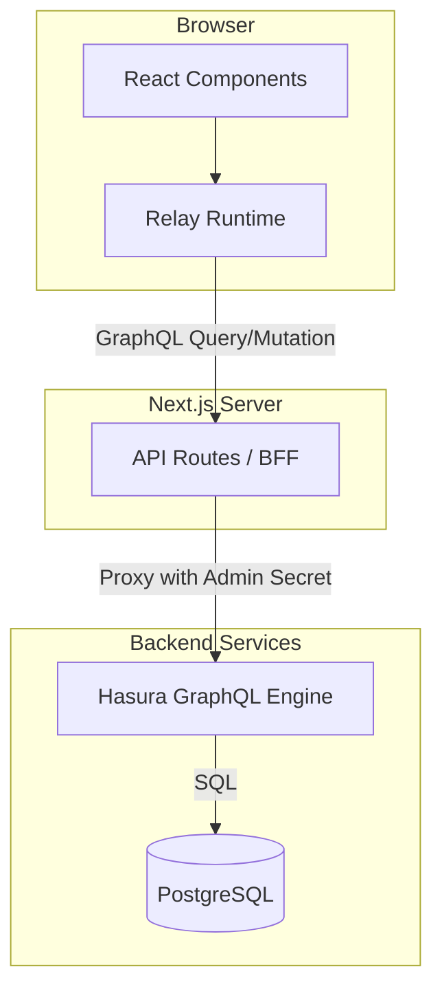
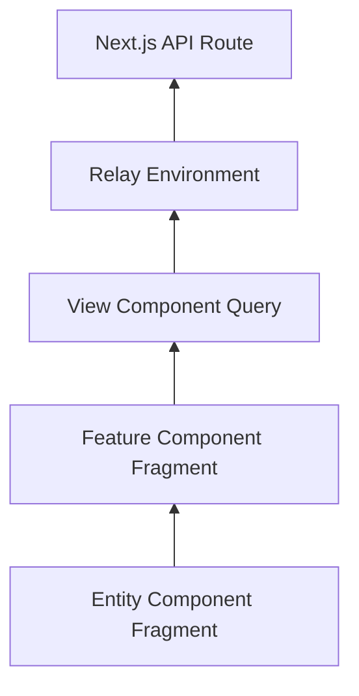

# アーキテクチャ設計

## システム全体像

本プロジェクトは **Next.js (App Router)** をフロントエンド及びBFF（Backend for Frontend）として使用し、**Hasura GraphQL Engine** をバックエンドの中核に据えた構成をとっています。



### コンポーネントの役割

- **Client (Browser)**:
  - ユーザーインターフェースの描画。
  - Relay によるデータフェッチとキャッシュ管理。
- **BFF (Next.js API Routes)**:
  - クライアントからのリクエスト認証（今回は簡易的）。
  - Hasura への接続情報（Admin Secret）の隠蔽。
  - カスタムロジック（CSVインポートなど）の実行。
- **Hasura GraphQL Engine**:
  - GraphQL API の自動生成。
  - データベースへのクエリ変換。
- **PostgreSQL**:
  - データの永続化。
  - 整合性の担保。

## ディレクトリ構成 (Feature-Sliced Design)

本プロジェクトでは、大規模なフロントエンド開発に適した **Feature-Sliced Design (FSD)** の考え方を取り入れたディレクトリ構成を採用しています。

```text
src/
├── app/          # Next.js App Router (Entry Point, Routing)
├── views/        # Page Components (画面全体の組み立て)
├── widgets/      # Compositional Layouts (Sidebar, Header etc.)
├── features/     # User Features (特定のビジネス機能・操作)
├── entities/     # Domain Entities (データ表示・モデル定義)
└── shared/       # Shared Utilities, UI Kit, Config (ドメイン知識なし)
```

### 各レイヤーの詳細

1. **`app/` (Application Layer)**
   - Next.js の App Router の仕組みに従ったファイル群 (`page.tsx`, `layout.tsx`, `route.ts`)。
   - グローバルな設定（Provider, Styles）を含む。
   - ここには複雑なロジックを書かず、`views` レイヤーのコンポーネントを呼び出すだけに留める。

2. **`views/` (Page Layer)**
   - 各ルートに対応するページコンポーネント（例: `ClubDetailView`）。
   - 複数の `widgets`, `features`, `entities` を組み合わせて画面全体を構成する。
   - ページ固有のデータ取得（Root Query）はこの層で定義するのが一般的。

3. **`widgets/` (Widget Layer)**
   - 画面のレイアウトを構成する独立したブロック（例: `GlobalHeader`, `Sidebar`）。
   - 複数の `features` や `entities` を内包することがある。

4. **`features/` (Feature Layer)**
   - ユーザーにとって意味のある機能単位（例: `ClubRegistrationForm`, `TransferList`）。
   - 特定のユースケース（登録、検索、フィルタリング）を実現するロジックを含む。

5. **`entities/` (Entity Layer)**
   - ビジネスエンティティ（例: `Club`, `Player`）に関連する表示コンポーネントやデータ定義（例: `ClubCard`, `PlayerAvatar`）。
   - 基本的に再利用性が高く、特定の「機能」には依存しない。データの表示が主な責務。

6. **`shared/` (Shared Layer)**
   - プロジェクト全体で共有される汎用的なコード。
   - **ui**: ボタン、入力フォームなどの汎用コンポーネント (`shadcn/ui` ベース)。
   - **api**: Relay Environment 設定、共通フック。
   - **lib**: ユーティリティ関数（日付フォーマット、数値計算など）。
   - **config**: 定数定義など。

## データフローとRelay

データ取得は **Relay** のコロケーション（Colocation）パターンに従います。各コンポーネントは自身が必要なデータを GraphQL Fragment として宣言し、親コンポーネントがそれを Query に組み込みます。



1. **Entity**: `fragment ClubCard_club on Club { name logo ... }`
2. **Feature**: `fragment ClubList_query on Query { clubs { ...ClubCard_club } }`
3. **View**: `query ClubListPageQuery { ...ClubList_query }`

これにより、Over-fetching（不要なデータの取得）や Under-fetching（必要なデータの不足）を防ぎ、コンポーネントとデータの依存関係を明確にします。

## マイグレーションとスキーマ管理

- **Prisma**: データベーススキーマの「正（Source of Truth）」として `schema.prisma` を使用。マイグレーションファイルの生成と適用を担当。
- **SQL**: Hasura は PostgreSQL のスキーマを読み取って API を提供するため、Prisma で変更を加えた後は Hasura のメタデータリロードが必要になる場合がある（基本的には自動追従）。
